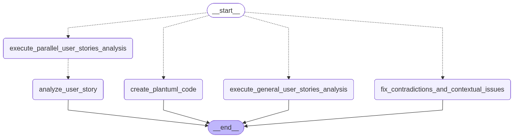
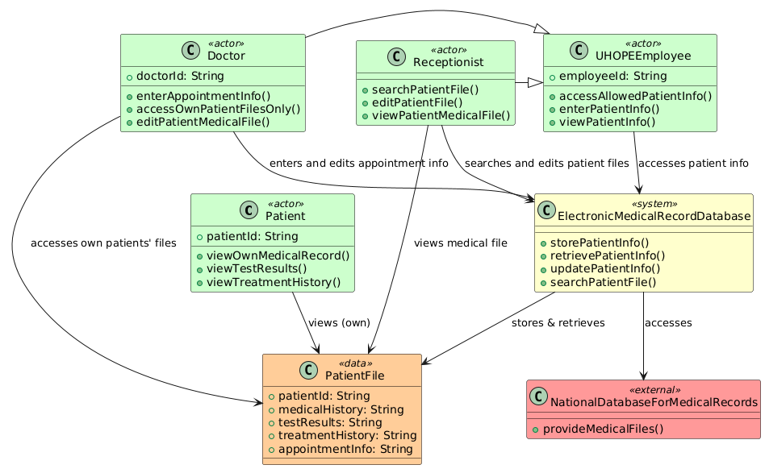

# User Stories Analyzer

A Streamlit-based application for analyzing, improving, and reporting on software user stories. The tool leverages LLMs (OpenAI/Groq via LangChain/LangGraph) to provide feedback, detect contradictions, suggest improvements, and generate UML class diagrams from user stories.

---

## Features

- **User Story Upload:** Upload user stories in `.txt`, `.csv`, or `.xlsx` format.
- **Automated Analysis:** 
  - Analyze user stories individually or as a group.
  - Get feedback on clarity, completeness, and suggestions for improvement.
  - Detect contradictions and contextual issues across stories.
- **Interactive Workflow:** 
  - Accept or reject suggested improvements.
  - Fix contradictions and contextual issues with one click.
- **Visualization:** 
  - Generate PlantUML class diagrams from user stories.
  - View diagrams directly in the app.
- **Reporting:** 
  - Generate a comprehensive PDF report including original, improved stories, analysis, and diagrams.

---

## Agent Flowchart

Below is the flowchart of the agent's logic, showing the main steps and decision points in the user stories analysis pipeline:



---

## Example Class Diagram

Here is an example of a UML class diagram generated from user stories (from the sample dataset):



---

## Project Structure

- [`app.py`](app.py): Main Streamlit app.
- [`agent/agent.py`](agent/agent.py): Core logic for LLM-based analysis, improvement, and diagram generation.
- [`file_helper.py`](file_helper.py): PDF report generation.
- [`dataset/HOS/`](dataset/HOS/): Example user stories and UML diagrams for various hospital scenarios.
- [`requirements.txt`](requirements.txt): Python dependencies.

---

## Usage

1. **Install dependencies:**
    ```sh
    pip install -r requirements.txt
    ```

2. **Set up API keys:**
    - Add your OpenAI and/or Groq API keys to `.streamlit/secrets.toml`:
      ```
      OPENAI_MODEL = "gpt-4o"
      OPENAI_KEY = "sk-..."
      GROQ_MODEL = "llama3-70b-8192"
      GROQ_KEY = "..."
      ```

3. **Run the app:**
    ```sh
    streamlit run [app.py](http://_vscodecontentref_/0)
    ```

4. **Workflow:**
    - Upload a file with user stories.
    - Analyze stories individually or together.
    - Review and apply suggested improvements.
    - Detect and fix contradictions/contextual issues.
    - Generate a UML class diagram.
    - Export a PDF report.

---

## Example Dataset

Sample user stories and diagrams are provided in [`dataset/HOS/`](dataset/HOS/).

---

## Dependencies

See [`requirements.txt`](requirements.txt) for all dependencies, including:
- `streamlit`
- `langgraph`
- `langchain-openai`
- `langchain-groq`
- `plantuml`
- `reportlab`
- `streamlit-pdf-viewer`

---

## License

MIT License

---

*Generated by [user_stories_analyzer](https://github.com/oscarismael47/user_stories_analyzer)*